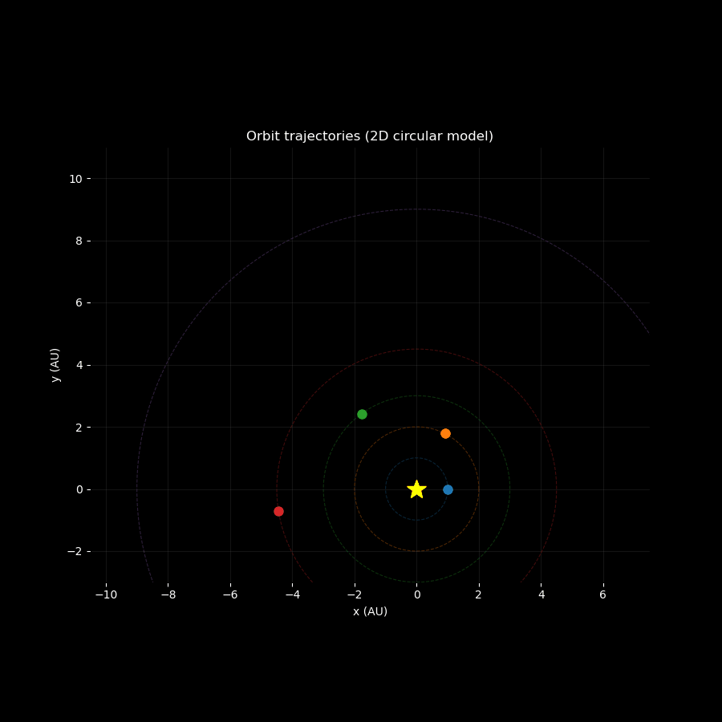

# SolsysGen & WaterIO

<p align="center">
  
</p>

## Overview

**SolsysGen** is a lightweight Python library for generating and simulating
deterministic heliocentric planetary systems using a simplified
**2D circular Keplerian model**.

**WaterIO** is a companion module providing robust and minimal
checkpointing utilities for NumPy arrays via compressed `.npz` files.

This project was designed as an educational and reproducible framework
for exploring orbital mechanics concepts without the complexity of
full N-body gravitational simulations.

---

## Motivation

When learning orbital mechanics or building procedural simulations,
it is often difficult to connect:

- mathematical equations (Kepler’s laws),
- simulation code,
- visual output,
- and persistent storage of results.

SolsysGen provides a minimal, transparent implementation that bridges
these components in a clear and reproducible way.

The goal is not astrophysical realism, but:

- conceptual clarity
- deterministic behavior
- reproducibility
- clean architecture
- modular extensibility

---

## Modeling Assumptions

The system follows a simplified heliocentric model:

- One central **Sun**
- Multiple **Planets**
- Coplanar, circular orbits
- Motion derived from **Kepler’s third law**
- No N-body gravity
- No perturbations
- No orbital migration
- No relativistic corrections

All physical quantities are stored internally in **SI units**.

This makes the system:

- stable
- deterministic
- computationally inexpensive
- ideal for teaching and demonstrations

---

## Design Philosophy

Unlike physics engines or astrophysical simulators, this project prioritizes:

- Readable source code
- Minimal dependencies
- Reproducible procedural generation
- Clean separation of concerns
- JSON export for structural reproducibility
- NPZ checkpointing for numerical reproducibility

It is suitable for:

- educational demos
- procedural system generation experiments
- visualization pipelines
- lightweight research prototypes
- academic presentations

It is **not intended** for high-precision astrophysical modeling.


---

## Project structure

```text
SolsysGen/
├── src/
│   ├── solsysgen/          # Core simulation & data model
│   └── waterio/            # Optional checkpoint / I/O helpers
├── docs/                   # MkDocs API documentation
├── examples/               # Runnable example scripts
├── tests/                  # Pytest test suite
├── mkdocs.yml
├── pyproject.toml
└── README.md
```


### Notes

- Optional native or Cython-based acceleration lives alongside the Python code.
- Build artifacts (`build/`, `*.so`, `__pycache__/`, `*.egg-info/`) are intentionally excluded from version control.
- The project functions fully in **pure Python** and does not require compiled extensions.

---

## SolsysGen

SolsysGen provides a small set of building blocks for heliocentric simulations.

## Core concepts

### Sun
Represents the central body (e.g. a star), defined by:

- mass  
- radius  
- luminosity  

All quantities are stored internally in **SI units**.

---

### Planet
A planet on a **2D circular orbit**, defined by:

- orbital distance  
- phase angle (initial position)  
- orbital period and orbital speed (derived from **Kepler’s third law**)  

The planet model is intentionally simple, stable, and deterministic.

---

### SolarSystem
A container holding:

- one `Sun`  
- a list of `Planet` objects  

It provides:

- explicit time stepping  
- access to current positions  
- JSON-friendly serialization  

---

## Orbital mechanics

SolsysGen uses **Kepler’s third law** for circular two-body orbits to compute:

- orbital period from distance  
- circular orbital speed  

Implementation details:

- implemented in **pure Python**  
- optional native or accelerated backends may be used if available  
- this is **not** an N-body integrator  

---

## Procedural generation

SolsysGen can generate deterministic, visually plausible systems using:

- logarithmically spaced orbital distances  
- simple planet type classification:
  - rocky  
  - gas giant  
  - ice giant  
  - dwarf  
- rough mass and radius heuristics per type  

This functionality is intended for **demos, testing, and visualization**, not scientific realism.

---

## I/O and checkpoints

### JSON export
Solar systems can be exported and reloaded via JSON for reproducibility, including:

- system structure  
- planet ordering  
- orbital parameters  

This allows generated systems to be saved and reused.

---

### NPZ checkpoints (optional)
The `waterio` module provides helpers to:

- save NumPy arrays to compressed `.npz` files  
- reload them safely for analysis or visualization  

This is especially useful for storing time-series data, such as planet positions over time.

---

## Examples

Run examples from the project root:

```bash
python examples/generate_and_summarize.py
python examples/track_one_planet.py
python examples/json_roundtrip_check.py
python examples/checkpoint_positions_npz.py
python examples/cython_planet_smoke.py
```


Each example demonstrates a **single focused concept**.

---

## Tutorial notebook

A full guided walkthrough is provided as a Jupyter notebook:


**solsysgen_tutorial.ipynb**


---

### It demonstrates:

- system generation
- time stepping
- Kepler helper functions
- JSON export/import
- NumPy checkpointing with WaterIO

This notebook is suitable for:

- a short technical presentation
- self-guided learning
- grading or review

---

## Installation

### Requirements

- Python ≥ 3.10
- pip
- (optional) C/C++ compiler for native extension

### Basic Installation (Pure Python)

```bash
pip install cython
```

Development Installation

```bash
pip install -e .
pip install -r requirements.txt
```

Optional:

```bash
pre-commit install
```

---

### Optional native acceleration

If a native or Cython backend is present, it will be used automatically.
The project functions fully **without** it.

---

## Building Documentation

API documentation is generated from docstrings using MkDocs:

```bash
mkdocs serve
```

Then open:

http://127.0.0.1:8000/

---

## Testing

Run the test suite with:

```bash
pytest
```

### Tests cover:

- Kepler formulas
- model behavior
- procedural generation
- system stepping
- JSON and checkpoint roundtrips
- NumPy checkpointing

---
## Intended use

SolsysGen and WaterIO are suitable for:

- educational demos
- teaching orbital mechanics basics
- visualization experiments
- lightweight simulations where clarity matters more than realism

They are **not** intended for high-precision astrophysical modeling.

---
## Acknowledgement


Portions of this project, including parts of the documentation and selected code refactoring steps, were developed and refined with the assistance of **AI-based** tools.

All architectural decisions, implementation logic, testing, and final validation were carried out and reviewed by the project **author** to ensure correctness, clarity, and reproducibility.

